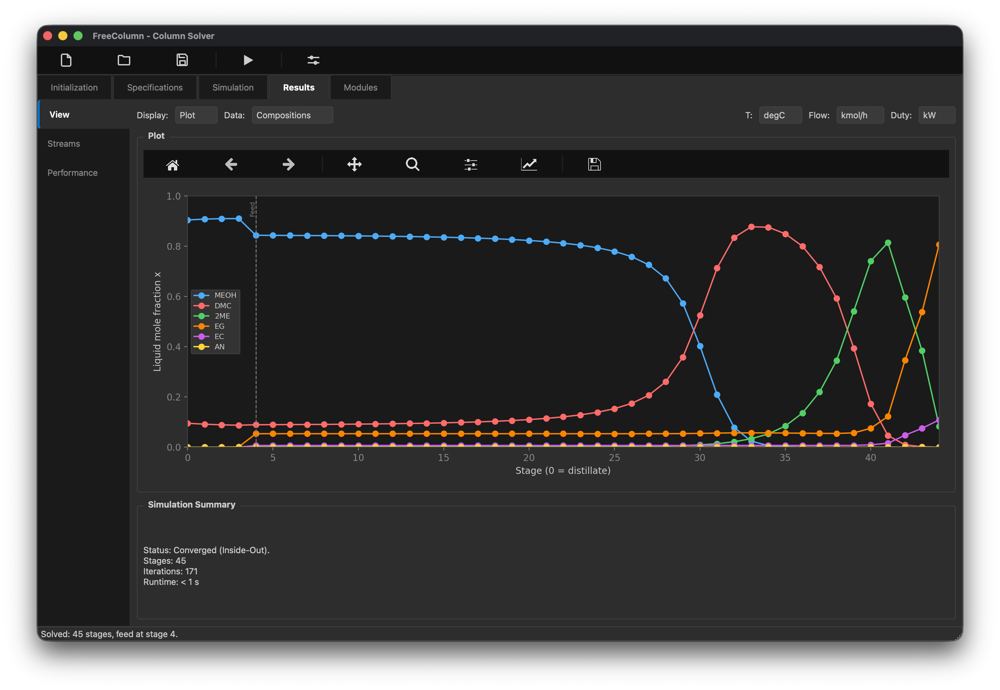
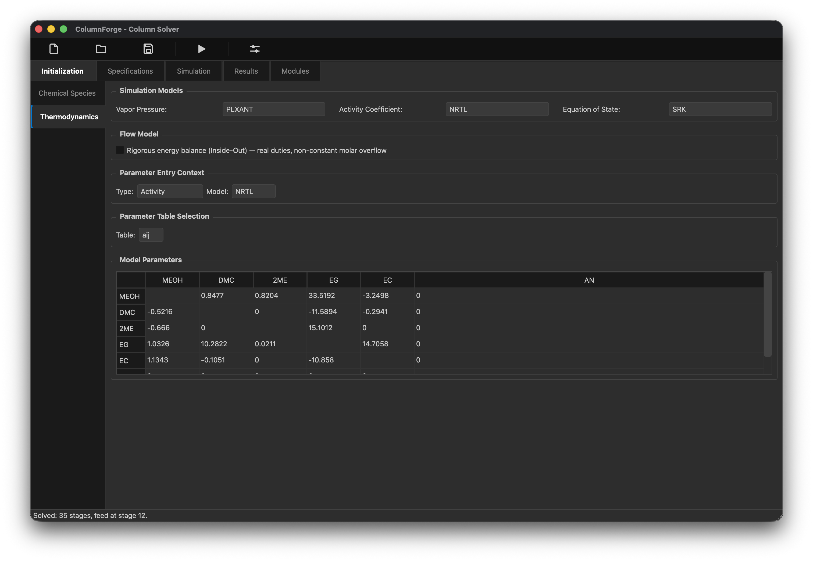
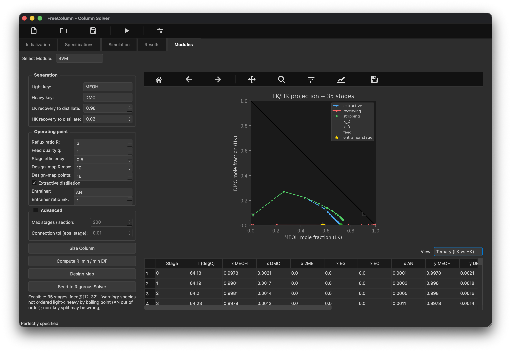
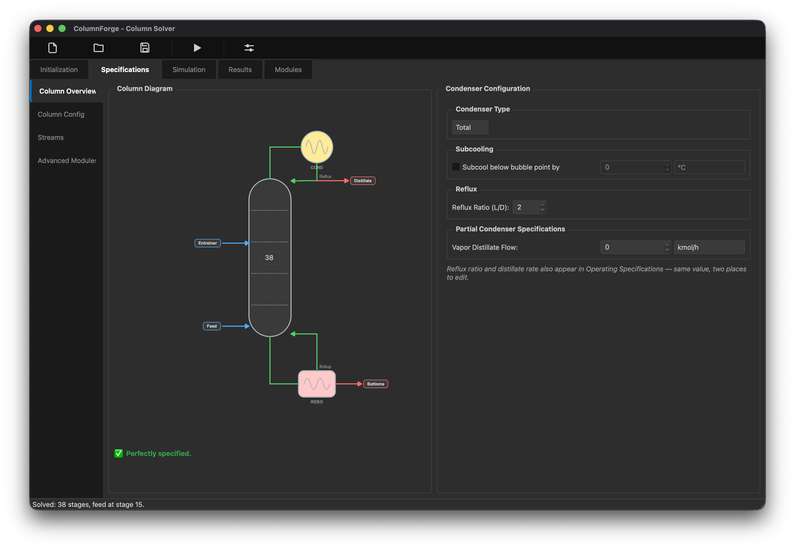
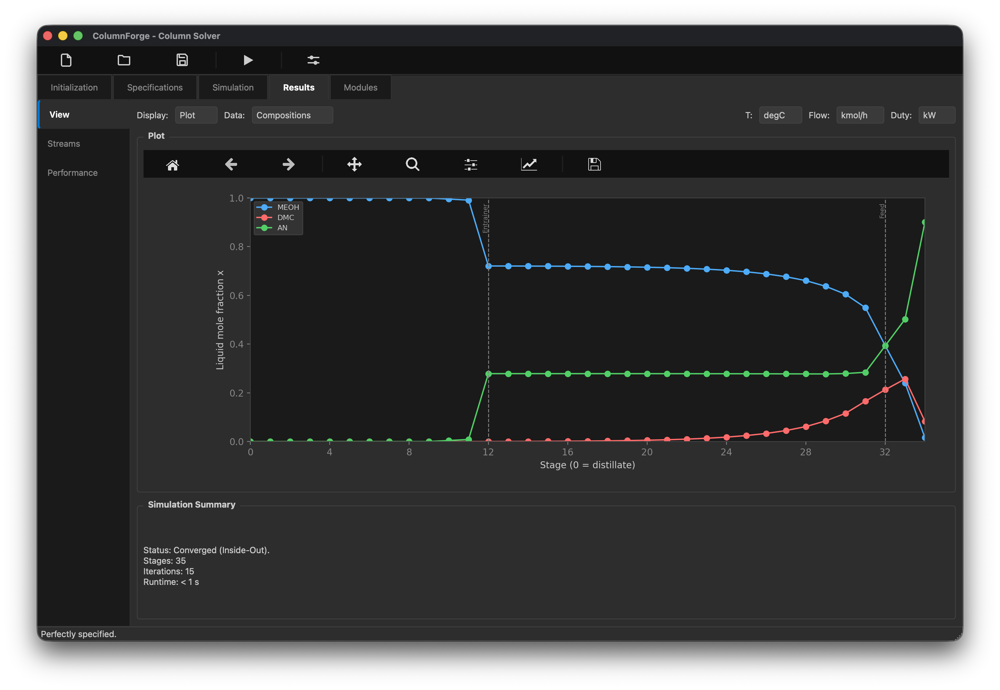

# FreeColumn — Distillation Column Solver

[](https://github.com/pierowemyss/FreeColumn/actions/workflows/ci.yml)

A PySide6 (Qt6) desktop app for designing and rating chemical-engineering
distillation columns, styled after Aspen Plus's RadFrac. Everything —
GUI, thermodynamics, and every solver — is pure Python (NumPy/SciPy), no
compiled dependency required to run it.

<!-- Screenshot: the money shot, above the fold. A full window on a converged
     multicomponent run, with the column diagram AND a composition profile plot
     visible at once. A viewer should register "this is a real simulator" in one
     glance, before reading a word. -->



## Why this exists

Commercial column simulators (Aspen Plus, HYSYS, ChemCAD) are black boxes:
you get an answer, not the Newton iteration that produced it. FreeColumn is
the opposite bet — every solver is legible, self-testing Python you can step
through, from the Antoine fit to the final tridiagonal solve. It was built to
answer a specific question honestly: _what does it actually take to converge
a multicomponent column, end to end?_ Three independent solver paths (a
classical Wang-Henke MESH solve, a Boston-Sullivan Inside-Out solve, and a
difference-point-chain boundary-value sizing tool) exist so their answers can be
checked against each other, not just against a textbook.

## Quick Start

```bash
pip install -r requirements.txt        # PySide6, numpy, scipy, matplotlib
python launch.py                       # run the GUI (canonical entry point)
```

`launch.py` puts `src/python` (for `core`/`gui`) and `src` (for
`side_features.*`) on the path and calls `gui.main_window.main()`. To run a
module directly, replicate those paths:
`PYTHONPATH=src:src/python python -m gui.main_window`.

### The RCM module needs a compiled library

Everything above is pure Python — no compiler required. The one exception is
the **RCM** module (residue-curve maps), which calls a Fortran/C solver through
`ctypes`. Prebuilt libraries ship in `src/side_features/freeRCM/lib/`, but they
are **x86_64 only**; on a different architecture (an arm64 Python on Apple
Silicon, for instance) they won't load and the module shows
"Compile RCM_solv.c to use this module." instead of a plot. To build them:

```bash
cd src/side_features/freeRCM/build && make    # needs gfortran + a C compiler
```

The rest of the app is unaffected either way.

## Architecture

FreeColumn is three layers. The GUI never does numerical work; it builds a
plain-data description of the column and hands it to a solver.

```
┌─────────────────────────────────────────────────────────────────┐
│  gui/                                                            │
│    WindowState  ──single source of truth for the whole session   │
│    tabs/  (Initialization → Specifications → Simulation →        │
│            Results → Modules)          panels/   state/          │
└───────────────────────────┬───────────────────────────────────────┘
                             │ WindowState.build_solver_input()
                             ▼
┌─────────────────────────────────────────────────────────────────┐
│  core/                                                            │
│    SolverInput  ──canonical column: open per-stage NumPy arrays  │
│    thermodynamics.py  (Antoine/PLXANT, K-values, activity/EOS)   │
│    column_solvers.py  (Bubble-Point, Inside-Out)                 │
│    dof.py / operating_specs.py  (spec ledger → (R, D))           │
│    material_balance.py / enthalpy.py / shortcut.py / flash.py    │
└───────────────────────────┬───────────────────────────────────────┘
                             │ (BVM sizes → warm-starts →)
                             ▼
┌─────────────────────────────────────────────────────────────────┐
│  side_features/bvm/          difference-point-chain             │
│                              boundary-value sizing (Modules tab)│
│  side_features/freeRCM/      residue-curve maps (Modules tab)    │
└─────────────────────────────────────────────────────────────────┘
```

`core` never imports `gui` — it's a standalone library you could drive from
a script or a Jupyter notebook with no Qt installed. Every `core` module also
carries a runnable self-check (`python -m core.column_solvers` and friends),
so correctness isn't only asserted by the pytest suite; each file vouches for
itself.

## The solvers

|                        | method                                       | answers                                                     | scope                                               |
| ---------------------- | -------------------------------------------- | ----------------------------------------------------------- | --------------------------------------------------- |
| **Bubble-Point**       | Wang-Henke MESH                              | rigorous tray-by-tray profile                               | CMO, total condenser                                |
| **Inside-Out (HYSIM)** | Boston-Sullivan two-tier                     | same, faster on stiff systems                               | CMO or full energy balance                          |
| **BVM**                | difference-point-chain boundary-value method | _is this split feasible, and how many stages does it need?_ | sizing/feasibility, energy balance, reactive stages |
| **Shortcut (FUG)**     | Fenske-Underwood-Gilliland-Kirkbride         | back-of-envelope N, R<sub>min</sub>, feed stage             | screening tool, constant α                          |

### Bubble-Point — Wang-Henke MESH

The textbook rigorous solve: **M**aterial balance, **E**quilibrium,
**S**ummation, **H**eat balance, solved stage-by-stage until temperatures
stop moving. FreeColumn assembles the per-component material balance as a
tridiagonal system in liquid composition and solves it with the Thomas
algorithm — one linear solve per component, per outer iteration:

$$
\underbrace{-L_{n-1} x_{i,n-1}}_{\text{liquid from stage above}} + \underbrace{\big(L_n + V_n K_{i,n}\big) x_{i,n}}_{\text{leaving stage } n} + \underbrace{\big(-V_{n+1} K_{i,n+1} x_{i,n+1}\big)}_{\text{vapour from stage below}} = F_n z_{i,n}
$$

$$
\text{Equilibrium:} \quad y_{i,n} = K_{i,n} x_{i,n}
\qquad
\text{Summation:} \quad \sum_i K_{i,n} x_{i,n} = 1 \quad \Rightarrow \quad T_n \text{ (bubble point)}
$$

with $K_i = \gamma_i \phi_i^{\mathrm{sat}} P_i^{\mathrm{sat}}(T) / (\phi_i^{V} P)$ (see
[Thermodynamics](docs/thermodynamics.md)).

Outer loop: assemble the tridiagonal system at the current `T` profile →
Thomas-solve for `x` → bubble-point each stage for a new `T` → repeat until
`max|ΔT| < tol`. Constant molar overflow (CMO) by default; an optional
`flows_hook` seam lets an energy balance replace the CMO flow assumption
without touching the assembly code.

### Inside-Out (HYSIM) — two-tier solve

The trick Boston & Sullivan used to make rigorous solves converge on stiff,
highly non-ideal systems: don't call the expensive thermodynamics (activity
model, Antoine, EOS) every inner iteration. Split into an **outer** loop that
refreshes rigorous K-values and freezes them into per-stage relative
volatilities, and a cheap **inner** loop that iterates only those frozen
ratios against the material balance:

**Outer** (expensive thermo, once per pass) — refresh rigorous K-values, then
freeze a per-stage base K and relative volatilities:

$$
K_{i,n} = \frac{\gamma_{i,n} \phi_i^{\mathrm{sat}} P^{\mathrm{sat}}_i(T_n)}{\phi^{V}_{i,n} P},
\qquad
K^{b}_{n} = \Big( \textstyle\prod_i K_{i,n} \Big)^{1/n_c},
\qquad
\alpha_{i,n} = \frac{K_{i,n}}{K^{b}_{n}}
$$

**Inner** (cheap, no thermo calls, iterated to `tol`) — hold $\alpha$ fixed and
converge the base K against the material balance and bubble constraint:

$$
x = \text{tridiagonal solve at } K_{i,n} = \alpha_{i,n} K^{b}_{n},
\qquad
K^{b}_{n,\text{new}} = \Big( \textstyle\sum_i \alpha_{i,n} x_{i,n} \Big)^{-1},
\qquad
\text{until } \frac{|K^{b}_{n,\text{new}} - K^{b}_{n}|}{K^{b}_{n}} < \text{tol}
$$

Refresh $T$ from a rigorous bubble-point on the new $x$, and repeat the outer
pass until $\max|\Delta T| < \text{tol}$.

Because the inner loop reuses one frozen $\alpha$, most of the iteration
avoids the thermo evaluation that dominates cost on multicomponent,
non-ideal mixtures — the same reason production simulators default to it.

### BVM — difference-point chain (Boundary Value Method)

BVM answers a different question than the two solvers above: not _converge
this column_, but _is this split even reachable, and with how many stages?_
Given an operating point `(R, S, E/F)`, it builds a **difference-point
chain** — one difference point $\Delta_k$ per column section — and marches
composition profiles inward from each product end until adjacent profiles
meet. The difference point is the net-flow composition of section $k$ (a mass
balance), collinear with every $(x,y)$ pair the section passes through:

$$
\Delta_k = \frac{V_k y_k - L_k x_k}{V_k - L_k}
$$

Each section is then marched stage by stage — an equilibrium step followed by
an operating-line step anchored on $\Delta_k$:

$$
\underbrace{y_{k,n} = K(x_{k,n}, T, P) \cdot x_{k,n}}_{\text{equilibrium step}}
\qquad \longrightarrow \qquad
\underbrace{x_{k,n+1} = \frac{V_k y_{k,n} - (V_k - L_k) \Delta_k}{L_k}}_{\text{operating-line step}}
$$

(the operating-line step is just the difference-point definition rearranged —
which is what makes $\Delta_k$, $x_{k,n+1}$ and $y_{k,n}$ collinear.)

Two profiles are **connected** when they come within tolerance of each
other in full $\mathbb{R}^{C-1}$ composition space (not a 2-D curve crossing — that
only exists for ternaries, which is why classical textbook BVM is
ternary-only). The stage count where that connection happens _is_ the
design output, not an input. Feasibility, R<sub>min</sub>, feed/draw
placement, and reactive-stage support (Ung-Doherty transform) all build on
top of this chain; see `src/side_features/bvm/README.md` for the
full module-by-module writeup. Module map:

```
problem.py    → feeds/draws/spec → overall balance (x_D, x_B, D, B)
sections.py   → difference-point chain (Δ_k, δ_k) + operating-line coeffs
march.py      → equilibrium + operating-line stepping, Murphree efficiency
anchor.py     → product ends, continuation, saddle-pinch manifold launch
connect.py    → closest-approach connection in full R^(C-1) → stage counts
place.py      → feed operating-line crossover, side-draw purity target
pinch.py      → fixed-point + eigenvalue classification → R_min, min E/F
reactive.py   → reaction-invariant transformed composition variables
diagnostics.py→ classified infeasibility (names the offending section/pinch)
driver.py     → size a column, sweep (R, S, E/F), build the design map
handoff.py    → package stages + profiles as a rigorous-solver warm start
api.py        → size_column / feasibility_map / to_solver (public entry points)
```

A sized BVM column can be sent straight to Bubble-Point as a **warm start**
(`api.to_solver`), converging in a fraction of the cold-start iterations —
the whole reason a sizing tool and a rigorous solver share a repository.

### Shortcut (FUG)

The pencil-and-paper method, kept honest as closed-form correlations rather
than a solve — the "where do I even start" tool that seeds a rigorous run:

**Fenske** — minimum stages at total reflux:

$$
N_{\min} = \frac{\ln \big[ (x_{LK}/x_{HK})_D (x_{HK}/x_{LK})_B \big]}{\ln \alpha_{LK,HK}}
$$

**Underwood** — minimum reflux (find the root $\theta$ between the key volatilities):

$$
\sum_i \frac{\alpha_i z_i}{\alpha_i - \theta} = 1 - q
\qquad\Longrightarrow\qquad
R_{\min} + 1 = \sum_i \frac{\alpha_i x_{D,i}}{\alpha_i - \theta}
$$

**Gilliland/Molokanov** — actual stages at operating reflux $R$:

$$
X = \frac{R - R_{\min}}{R + 1},
\qquad
Y = 1 - \exp \left[ \frac{1 + 54.4X}{11 + 117.2X} \cdot \frac{X - 1}{\sqrt{X}} \right],
\qquad
N = \frac{Y + N_{\min}}{1 - Y}
$$

**Kirkbride** — feed-stage location ($N_r$ rectifying, $N_s$ stripping stages):

$$
\frac{N_r}{N_s} = \left[ \frac{B}{D} \cdot \frac{x_{F,HK}}{x_{F,LK}} \cdot \left( \frac{x_{B,LK}}{x_{D,HK}} \right)^{2} \right]^{0.206}
$$

## Thermodynamics

Every solver goes through one seam — the equilibrium ratio $K_i = y_i/x_i$:

$$
K_i = \frac{\gamma_i(x,T) \phi_i^{\mathrm{sat}} P^{\mathrm{sat}}_i(T)}{\phi_i^{V}(y,T,P) P}
$$

Swapping a model means swapping what plugs into that seam — solvers never
change. **Full equations for every model below are in
[`docs/thermodynamics.md`](docs/thermodynamics.md).**

- **Vapour pressure**: Antoine ($\log_{10} P^{\mathrm{sat}} = A - B/(T+C)$) or
  Aspen extended Antoine / PLXANT
  ($\ln P^{\mathrm{sat}} = C_1 + C_2/(C_3+T) + C_4 T + C_5\ln T + C_6 T^{C_7}$),
  dispatched automatically on coefficient-matrix width.
- **Activity coefficients** (non-ideal liquids): **NRTL**, **Wilson**,
  **UNIQUAC**, two-suffix **Margules**, and **UNIFAC** group-contribution
  (needs no binary parameters — built from the bundled group-interaction
  database). Each model raises a user-facing error when its parameters are
  missing rather than silently falling back to ideal.
- **Equation of state** (vapour-phase fugacity): **SRK**, for pressure
  effects on relative volatility (validated on a 4-atm depropanizer).
- **Component database**: 78 curated species (`core/data/components.json`) —
  Antoine/PLXANT fits, Tc/Pc/ω, Cp, latent heat — searchable by name, alias,
  CAS, or formula, one click to load into a column. Every record is gated by
  a physical-consistency test (Antoine reproduces Tb within 1 K, ΔHvap
  matches Clausius-Clapeyron within 12%). 7 curated NRTL binary pairs ship
  with it, gated against known azeotropes (ethanol/water,
  2-propanol/water, acetone/chloroform, acetone/methanol).
- **Enthalpy**: constant liquid $c_p$ + Watson-corrected latent heat
  ($h_V(T) = h_L(T) + \Delta H_{\mathrm{vap},T_b} [(T_c-T)/(T_c-T_b)]^{0.38}$),
  the shared seam behind the Inside-Out energy balance, enthalpy-based feed
  quality, and condenser subcooling.

<!-- Screenshot: Thermodynamics sub-tab. Show the NRTL binary interaction
     parameter table filled in for a real pair — clearest evidence that the
     thermo is modelled, not hardcoded. -->



## Modules tab

Standalone tools that share the session's species/thermo but don't need a
full column defined:

| module              | what it does                                                                                                        |
| ------------------- | ------------------------------------------------------------------------------------------------------------------- |
| **RCM**             | residue-curve maps (the preserved predecessor app, `side_features/freeRCM/`)                                        |
| **BVM**             | size/feasibility per above — size at one `R`, sweep a design map, send a warm start to the rigorous solver          |
| **Shortcut (FUG)**  | Fenske/Underwood/Gilliland/Kirkbride report + stages-vs-reflux curve                                                |
| **Txy/Pxy**         | binary bubble/dew loci at fixed P or T, plus an azeotrope table (singular-point classification)                     |
| **Pure Components** | browse/search the 78-species database, plot Psat(T), load straight into the column                                  |
| **Phase EQ**        | isothermal / vapour-fraction flash on the loaded species — a live test bench for whichever thermo model is selected |

<!-- Screenshot: Modules tab, BVM. The differentiator — show the
     difference-point-chain / feasibility map on a ternary diagram. It is the
     most technically distinctive artifact here and the thing a reviewer is
     least likely to have seen in another portfolio project. -->



## Column setup and results

<!-- Screenshot: Specifications tab. Show the interactive column overview
     diagram with a stage selected and the DoF ledger reading "fully
     specified" — the most Aspen-like screen in the app, and the one that
     sells the UI work. -->



- **Species & thermodynamics**: pick VLE/activity/EOS models, edit binary
  interaction tables, search or hand-enter component properties.
- **Column/streams/condenser/reboiler** configuration with a live
  degrees-of-freedom status (`core/dof.py`) — the app tells you exactly how
  many more specs it needs, and which kinds are valid under the active flow
  model, before you hit run.
- **Interactive column diagram** (Specifications → Column Overview): stages,
  feeds, draws, and interheater/intercooler modules on one canvas.
- **Complex topology**: interheaters/intercoolers carry a signed duty the
  energy balance consumes as a real per-stage term.
- **Threaded solves**: every solver runs on a QThread with live
  iteration/residual progress and a real Abort.
- **Results**: composition/temperature/pressure/flow/K-value/enthalpy
  profile plots, a McCabe-Thiele diagram for binary columns, a
  component-aware data table, product-stream summary with mass-balance
  closure, and CSV export. Display units (°C/K/°F, kmol/h/kg/h, kW/MW/kJ/h)
  are chosen independently of solver-internal units.
- **Save/Load**: the full session persists to `.colx` — versioned JSON, never
  pickle, so an old save stays readable by a newer build and vice versa.

<!-- Screenshot: Results tab. Show off the plotting depth — a McCabe-Thiele
     diagram (or the ternary residue-curve overlay) alongside the product-stream
     summary table with duties in kW, so the numbers read as engineering-grade
     rather than toy output. -->



## Project Structure

```
freeColumn/
├── src/
│   ├── python/
│   │   ├── core/          # thermodynamics, solvers, dof, material/energy balance
│   │   │   └── data/      # components.json, unifac_groups.json
│   │   ├── gui/
│   │   │   ├── tabs/      # Initialization / Specifications / Simulation / Results / Modules
│   │   │   ├── panels/    # reusable config panels (species, streams, condenser, ...)
│   │   │   ├── modules/   # BVM, FUG, Txy/Pxy, Pure Components, Phase EQ widgets
│   │   │   ├── state/     # WindowState (single source of truth) + .colx persistence
│   │   │   └── theme/     # Qt stylesheet
│   │   └── tests/         # headless pytest suite (+ tests/validation/)
│   ├── side_features/
│   │   ├── bvm/           # difference-point-chain BVM solver (own README + tests/)
│   │   └── freeRCM/       # preserved predecessor (residue curve maps)
│   └── native/            # Fortran sources (nifco2.f90) — not bound to the app yet
├── docs/                  # thermodynamics.md (equation reference), examples/, img/
└── launch.py              # GUI entry point
```

## Testing

The solver and state layers are Qt-free and self-checking. 113 tests, run
headless:

```bash
QT_QPA_PLATFORM=offscreen python -m pytest src/python/tests/ src/side_features/bvm/tests/
```

`src/python/tests/validation/` is the acceptance gate for solver changes —
BTX ideal, a depropanizer through the PLXANT path, ethanol/water vs its
known NRTL azeotrope, methanol/water vs Perry's VLE data. Every `core`
module is also runnable standalone as a self-check, e.g.
`PYTHONPATH=src/python python -m core.column_solvers`. CI (GitHub Actions)
runs the full suite plus `pyflakes` on Python 3.11 and 3.12.

## Conventions worth knowing

- **Stage 0 = distillate (top)** everywhere in the GUI and result profiles;
  solvers may use a different internal ordering, converted at the boundary.
- **Nothing is silently ignored**: every value you can enter is either
  consumed by the active solver or visibly greyed out with a "not consumed
  yet" tooltip.
- `.colx` files are versioned JSON — no pickle, so an old save stays
  readable by a newer build and vice versa.

## Screenshots

Placeholders above point at `docs/img/*.png` — drop screenshots of the
running app there with matching filenames and they'll render in place. An
HTML comment above each embed says what that shot should show off:

- `docs/img/hero.png` — converged run, diagram + profile plot together
- `docs/img/specifications-tab.png` — column diagram + DoF ledger
- `docs/img/modules-bvm.png` — BVM ternary feasibility map
- `docs/img/thermodynamics-subtab.png` — NRTL interaction table
- `docs/img/results-tab.png` — McCabe-Thiele + stream summary

## Roadmap / not yet built

- Native C/Fortran acceleration (`src/native/` sources exist but aren't
  compiled or bound yet).
- A full energy balance in the core Bubble-Point/Inside-Out solvers is
  opt-in for Inside-Out; Bubble-Point is CMO-only (BVM has its own energy
  balance already).
- A full 3-section extractive BVM (interior-section stage counts are
  feasibility-grade, not yet literature-exact — see the "known ceilings"
  section of `src/side_features/bvm/README.md`).

## Licence

MIT — see [LICENSE](LICENSE).
