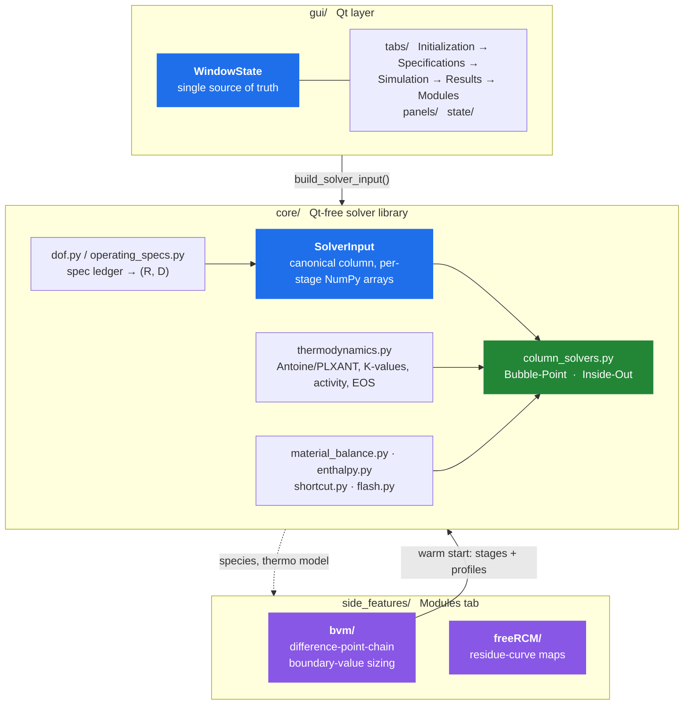
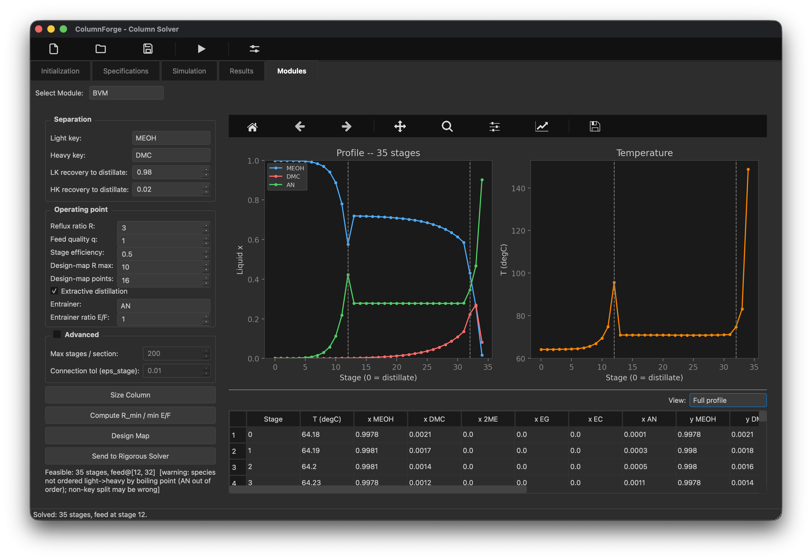
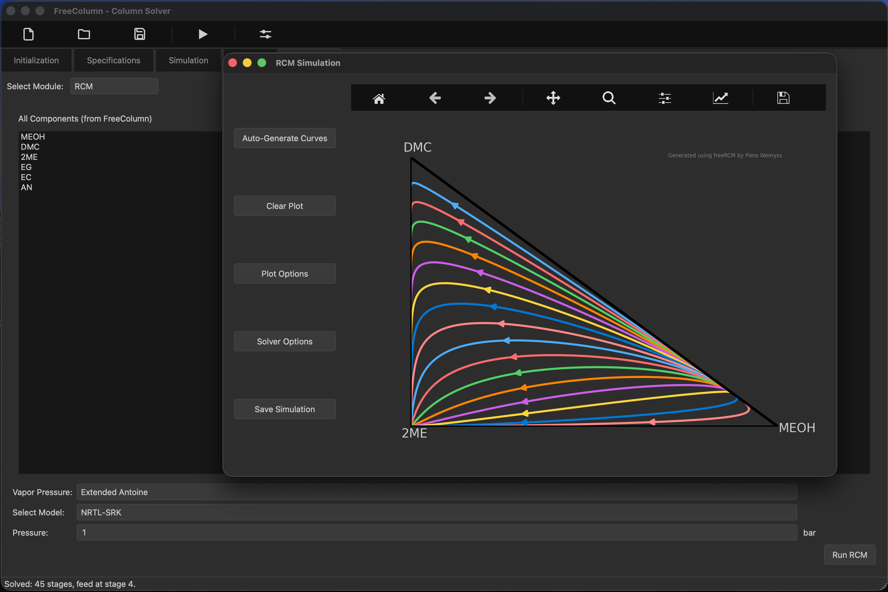
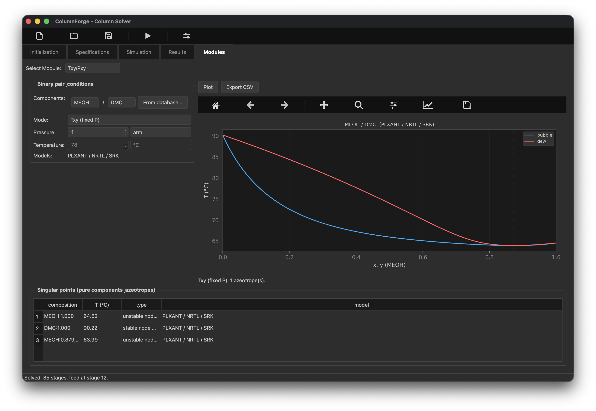
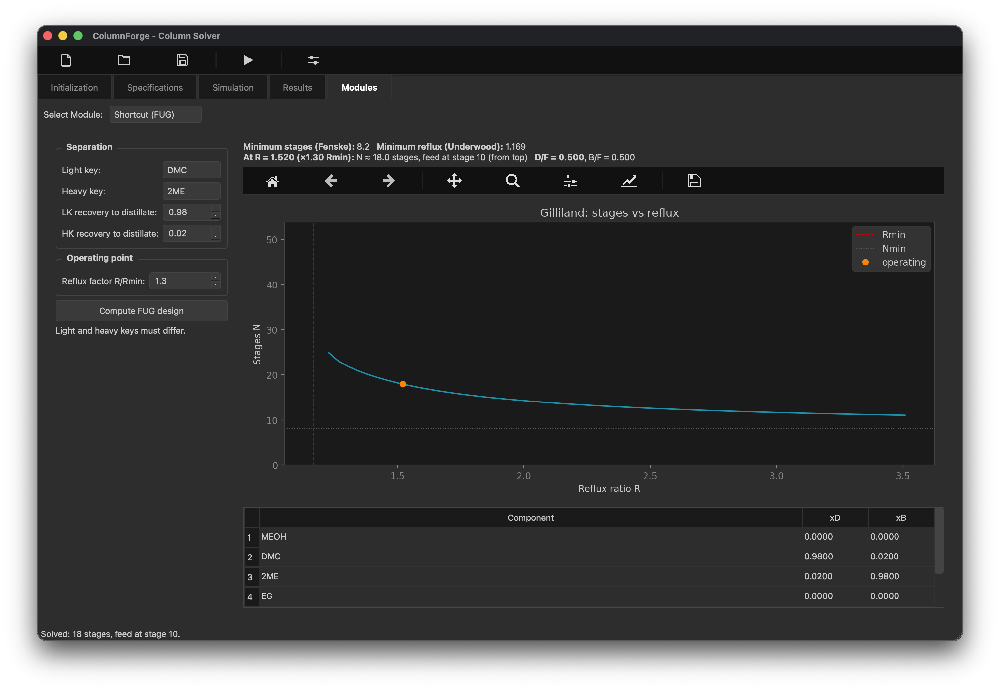

# ColumnForge

A PySide6 (Qt6) desktop app for designing and modeling distillation columns:
thermodynamic analysis, preliminary design, and rigorous solving in one workflow.


## Why this exists

Commercial simulators ship powerful column solvers, but their design workflows
and initialization methods are proprietary and hard to inspect or extend.
ColumnForge is the open version of that workflow, with the synthesis tools
(RCM, BVM, FUG, Txy/Pxy) feeding the rigorous solver directly.

|                       | commercial simulator          | ColumnForge                                        |
| --------------------- | ----------------------------- | -------------------------------------------------- |
| solver internals      | opaque                        | readable Python, one self-check per module          |
| initialization        | proprietary                   | BVM/FUG warm start, every intermediate visible      |
| preliminary design    | separate tools, manual bridge | RCM/BVM/FUG in-app, sharing the session's thermo    |
| when it fails to converge | "no solution found"       | named section, pinch, or spec that caused it        |

## Quick Start

```bash
pip install -r requirements.txt        # PySide6, numpy, scipy, matplotlib
python launch.py                       # run the GUI (canonical entry point)
```

`launch.py` puts `src/python` (for `core`/`gui`) and `src` (for
`side_features.*`) on the path and calls `gui.main_window.main()`. To run a
module directly, replicate those paths:
`PYTHONPATH=src:src/python python -m gui.main_window`.

**Solver backend.** Python is the backend that ships today, and it needs no
compiler. A compiled C/Fortran backend selectable from the UI is in progress;
the sources live in `src/native/`.

### The RCM module needs a compiled library

**RCM** (residue-curve maps) calls a Fortran/C solver through `ctypes`.
Prebuilt libraries ship in `src/side_features/freeRCM/lib/`, but they are
x86_64 only. On a different architecture (an arm64 Python on Apple Silicon,
say) they will not load and the module shows "Compile RCM_solv.c to use this
module." instead of a plot. To build them:

```bash
cd src/side_features/freeRCM/build && make    # needs gfortran + a C compiler
```

The rest of the app is unaffected either way.

## Architecture

Three layers. The GUI never does numerical work; it builds a plain-data
description of the column and hands it to a solver.



`core` never imports `gui`; it is a standalone library you can drive from a
script or notebook with no Qt installed. Every `core` module carries a runnable
self-check (`python -m core.column_solvers` and friends), so each file vouches
for itself independently of the pytest suite.

## The solvers

|                        | method                                       | answers                                                     | scope                                               |
| ---------------------- | -------------------------------------------- | ----------------------------------------------------------- | --------------------------------------------------- |
| **Bubble-Point**       | Wang-Henke MESH                              | rigorous tray-by-tray profile                               | CMO, total condenser                                |
| **Inside-Out (HYSIM)** | Boston-Sullivan two-tier                     | same, faster on stiff systems                               | CMO or full energy balance                          |
| **BVM**                | difference-point-chain boundary-value method | _is this split feasible, and how many stages does it need?_ | sizing/feasibility, energy balance, reactive stages |
| **Shortcut (FUG)**     | Fenske-Underwood-Gilliland-Kirkbride         | back-of-envelope N, R<sub>min</sub>, feed stage             | screening tool, constant α                          |

### Bubble-Point (Wang-Henke MESH)

**M**aterial balance, **E**quilibrium, **S**ummation, **H**eat balance, solved
stage-by-stage until temperatures stop moving. The per-component material
balance is a tridiagonal system in liquid composition, solved with the Thomas
algorithm: one linear solve per component, per outer iteration.

$$
\underbrace{-L_{n-1} x_{i,n-1}}_{\text{liquid from stage above}} + \underbrace{\big(L_n + V_n K_{i,n}\big) x_{i,n}}_{\text{leaving stage } n} + \underbrace{\big(-V_{n+1} K_{i,n+1} x_{i,n+1}\big)}_{\text{vapour from stage below}} = F_n z_{i,n}
$$

$$
\text{Equilibrium:} \quad y_{i,n} = K_{i,n} x_{i,n}
\qquad
\text{Summation:} \quad \sum_i K_{i,n} x_{i,n} = 1 \quad \Rightarrow \quad T_n \text{ (bubble point)}
$$

with $K_i = \gamma_i \phi_i^{\mathrm{sat}} P_i^{\mathrm{sat}}(T) / (\phi_i^{V} P)$
(see [Thermodynamics](docs/thermodynamics.md)).

Outer loop:

1. assemble the tridiagonal system at the current `T` profile
2. Thomas-solve for `x`
3. bubble-point each stage for a new `T`
4. repeat until `max|ΔT| < tol`

Constant molar overflow (CMO) by default. An optional `flows_hook` seam lets an
energy balance replace the CMO flow assumption without touching the assembly
code.

### Inside-Out (HYSIM), two-tier solve

Rigorous thermodynamics (activity model, Antoine, EOS) is too expensive to call
every inner iteration. Boston and Sullivan's split: an **outer** loop refreshes
rigorous K-values and freezes them into per-stage relative volatilities, and a
cheap **inner** loop iterates only those frozen ratios against the material
balance.

**Outer** (expensive thermo, once per pass), freeze a per-stage base K and
relative volatilities:

$$
K_{i,n} = \frac{\gamma_{i,n} \phi_i^{\mathrm{sat}} P^{\mathrm{sat}}_i(T_n)}{\phi^{V}_{i,n} P},
\qquad
K^{b}_{n} = \Big( \textstyle\prod_i K_{i,n} \Big)^{1/n_c},
\qquad
\alpha_{i,n} = \frac{K_{i,n}}{K^{b}_{n}}
$$

**Inner** (no thermo calls), hold $\alpha$ fixed and converge the base K against
the material balance and bubble constraint:

$$
x = \text{tridiagonal solve at } K_{i,n} = \alpha_{i,n} K^{b}_{n},
\qquad
K^{b}_{n,\text{new}} = \Big( \textstyle\sum_i \alpha_{i,n} x_{i,n} \Big)^{-1},
\qquad
\text{until } \frac{|K^{b}_{n,\text{new}} - K^{b}_{n}|}{K^{b}_{n}} < \text{tol}
$$

Refresh $T$ from a rigorous bubble-point on the new $x$, repeat the outer pass
until $\max|\Delta T| < \text{tol}$. Because the inner loop reuses one frozen
$\alpha$, most of the iteration avoids the thermo evaluation that dominates cost
on multicomponent, non-ideal mixtures.

### BVM, difference-point chain (Boundary Value Method)

Not _converge this column_ but _is this split reachable, and with how many
stages?_ Given an operating point `(R, S, E/F)`, BVM builds one **difference
point** $\Delta_k$ per column section, the net-flow composition of that section,
collinear with every $(x,y)$ pair the section passes through:

$$
\Delta_k = \frac{V_k y_k - L_k x_k}{V_k - L_k}
$$

Each section marches stage by stage, an equilibrium step followed by an
operating-line step anchored on $\Delta_k$ (the operating-line step is the
difference-point definition rearranged, which is what makes $\Delta_k$,
$x_{k,n+1}$ and $y_{k,n}$ collinear):

$$
\underbrace{y_{k,n} = K(x_{k,n}, T, P) \cdot x_{k,n}}_{\text{equilibrium step}}
\qquad \longrightarrow \qquad
\underbrace{x_{k,n+1} = \frac{V_k y_{k,n} - (V_k - L_k) \Delta_k}{L_k}}_{\text{operating-line step}}
$$

Profiles march inward from each product end until adjacent profiles meet. Two
profiles are **connected** when they come within tolerance in full
$\mathbb{R}^{C-1}$ composition space, not as a 2-D curve crossing, which is why
this is not limited to the ternaries of textbook BVM. The stage count where the
connection happens _is_ the output, not an input. Feasibility, R<sub>min</sub>,
feed/draw placement, and reactive stages (Ung-Doherty transform) build on the
same chain.

```
problem.py    → feeds/draws/spec → overall balance (x_D, x_B, D, B)
sections.py   → difference-point chain (Δ_k, δ_k) + operating-line coeffs
march.py      → equilibrium + operating-line stepping, Murphree efficiency
anchor.py     → product ends, continuation, saddle-pinch manifold launch
connect.py    → closest-approach connection in full R^(C-1) → stage counts
place.py      → feed operating-line crossover, side-draw purity target
pinch.py      → fixed-point + eigenvalue classification → R_min, min E/F
reactive.py   → reaction-invariant transformed composition variables
diagnostics.py→ classified infeasibility (names the offending section/pinch)
driver.py     → size a column, sweep (R, S, E/F), build the design map
handoff.py    → package stages + profiles as a rigorous-solver warm start
api.py        → size_column / feasibility_map / to_solver (public entry points)
```

A sized BVM column goes straight to Bubble-Point as a **warm start**
(`api.to_solver`), converging in a fraction of the cold-start iterations. Full
module-by-module writeup: `src/side_features/bvm/README.md`.

### Shortcut (FUG)

Closed-form correlations rather than a solve, the "where do I even start" tool
that seeds a rigorous run.

**Fenske**, minimum stages at total reflux:

$$
N_{\min} = \frac{\ln \big[ (x_{LK}/x_{HK})_D (x_{HK}/x_{LK})_B \big]}{\ln \alpha_{LK,HK}}
$$

**Underwood**, minimum reflux (root $\theta$ between the key volatilities):

$$
\sum_i \frac{\alpha_i z_i}{\alpha_i - \theta} = 1 - q
\qquad\Longrightarrow\qquad
R_{\min} + 1 = \sum_i \frac{\alpha_i x_{D,i}}{\alpha_i - \theta}
$$

**Gilliland/Molokanov**, actual stages at operating reflux $R$:

$$
X = \frac{R - R_{\min}}{R + 1},
\qquad
Y = 1 - \exp \left[ \frac{1 + 54.4X}{11 + 117.2X} \cdot \frac{X - 1}{\sqrt{X}} \right],
\qquad
N = \frac{Y + N_{\min}}{1 - Y}
$$

**Kirkbride**, feed-stage location ($N_r$ rectifying, $N_s$ stripping stages):

$$
\frac{N_r}{N_s} = \left[ \frac{B}{D} \cdot \frac{x_{F,HK}}{x_{F,LK}} \cdot \left( \frac{x_{B,LK}}{x_{D,HK}} \right)^{2} \right]^{0.206}
$$

## Thermodynamics

Every solver goes through one seam, the equilibrium ratio $K_i = y_i/x_i$:

$$
K_i = \frac{\gamma_i(x,T) \phi_i^{\mathrm{sat}} P^{\mathrm{sat}}_i(T)}{\phi_i^{V}(y,T,P) P}
$$

Swapping a model means swapping what plugs into that seam. Solvers never change.

| layer                 | models                                                                                                                                                                                                    |
| --------------------- | --------------------------------------------------------------------------------------------------------------------------------------------------------------------------------------------------------- |
| **vapour pressure**   | Antoine $\log_{10} P^{\mathrm{sat}} = A - B/(T+C)$, or Aspen extended Antoine / PLXANT $\ln P^{\mathrm{sat}} = C_1 + C_2/(C_3+T) + C_4 T + C_5\ln T + C_6 T^{C_7}$, dispatched on coefficient-matrix width |
| **activity** $\gamma$ | NRTL, Wilson, UNIQUAC, two-suffix Margules, UNIFAC group contribution (no binary parameters needed, built from the bundled group-interaction database)                                                     |
| **equation of state** | SRK vapour-phase fugacity, for pressure effects on relative volatility (validated on a 4-atm depropanizer)                                                                                                 |
| **enthalpy**          | constant liquid $c_p$ + Watson-corrected latent heat, $h_V(T) = h_L(T) + \Delta H_{\mathrm{vap},T_b} \left[ (T_c-T)/(T_c-T_b) \right]^{0.38}$                                                              |

Full equations for every model: [`docs/thermodynamics.md`](docs/thermodynamics.md).

- **78 curated components** (`core/data/components.json`), searchable by name,
  alias, CAS, or formula, one click to load into a column. Every record is gated
  by a physical-consistency test: Antoine reproduces Tb within 1 K, ΔHvap
  matches Clausius-Clapeyron within 12%.
- **7 NRTL binary pairs** ship with it, gated against known azeotropes
  (ethanol/water, 2-propanol/water, acetone/chloroform, acetone/methanol).
- **No silent fallback.** A model with missing parameters raises a user-facing
  error instead of quietly reverting to ideal.
- The enthalpy seam is shared by the Inside-Out energy balance, enthalpy-based
  feed quality, and condenser subcooling.


## Modules tab

Standalone tools that share the session's species and thermo but need no full
column defined.

| module              | what it does                                                                                                       |
| ------------------- | ------------------------------------------------------------------------------------------------------------------ |
| **RCM**             | residue-curve maps (the preserved predecessor app, `side_features/freeRCM/`)                                       |
| **BVM**             | size at one `R`, sweep a design map, send a warm start to the rigorous solver                                      |
| **Shortcut (FUG)**  | Fenske/Underwood/Gilliland/Kirkbride report + stages-vs-reflux curve                                               |
| **Txy/Pxy**         | binary bubble/dew loci at fixed P or T, plus an azeotrope table (singular-point classification)                    |
| **Pure Components** | browse/search the 78-species database, plot Psat(T), load straight into the column                                 |
| **Phase EQ**        | isothermal / vapour-fraction flash on the loaded species, a live test bench for whichever thermo model is selected |

<table>
  <tr>
    <td width="50%" valign="top">
      <a href="docs/img/modules-bvm.png"></a>
      <br><b>BVM</b> feasibility / design map
    </td>
    <td width="50%" valign="top">
      <a href="docs/img/bvm-profile-prediction.png"></a>
      <br><b>BVM</b> stage and temperature profile
    </td>
  </tr>
  <tr>
    <td width="50%" valign="top">
      <a href="docs/img/rcm-module.png"></a>
      <br><b>RCM</b> residue-curve map
    </td>
    <td width="50%" valign="top">
      <a href="docs/img/modules-txy.png"></a>
      <br><b>Txy/Pxy</b> binary envelope + azeotropes
    </td>
  </tr>
  <tr>
    <td width="50%" valign="top">
      <a href="docs/img/modules-fug.png"></a>
      <br><b>Shortcut (FUG)</b> stages vs reflux
    </td>
    <td width="50%" valign="top">
      <a href="docs/img/modules-phaseeq.png"></a>
      <br><b>Phase EQ</b> flash bench
    </td>
  </tr>
</table>

## Column setup and results


- **Species & thermodynamics**: VLE/activity/EOS model choice, editable binary
  interaction tables, searchable or hand-entered component properties.
- **Live degrees-of-freedom status** (`core/dof.py`): how many more specs the
  column needs, and which kinds are valid under the active flow model, before
  you hit run.
- **Interactive column sandbox** (Specifications → Column Overview): stages,
  feeds, draws, interreboiler/intercooler modules on one canvas.
- **Complex topology**: interreboilers and intercoolers carry a signed duty the
  energy balance consumes as a real per-stage term.
- **Threaded solves**: every solver runs on a QThread with live
  iteration/residual progress and a real Abort.
- **Results**: composition, temperature, pressure, flow, K-value, and enthalpy
  profile plots; a McCabe-Thiele diagram for binary columns; a component-aware
  data table; product-stream summary with mass-balance closure; CSV export.
  Display units (°C/K/°F, kmol/h, kg/h, kW/MW/kJ/h) are independent of
  solver-internal units.
- **Save/Load**: the full session persists to `.colx`, versioned JSON, never
  pickle.


## Project Structure

```
columnForge/
├── src/
│   ├── python/
│   │   ├── core/          # thermodynamics, solvers, dof, material/energy balance
│   │   │   └── data/      # components.json, unifac_groups.json
│   │   ├── gui/
│   │   │   ├── tabs/      # Initialization / Specifications / Simulation / Results / Modules
│   │   │   ├── panels/    # reusable config panels (species, streams, condenser, ...)
│   │   │   ├── modules/   # BVM, FUG, Txy/Pxy, Pure Components, Phase EQ widgets
│   │   │   ├── state/     # WindowState (single source of truth) + .colx persistence
│   │   │   └── theme/     # Qt stylesheet
│   │   └── tests/         # headless pytest suite (+ tests/validation/)
│   ├── side_features/
│   │   ├── bvm/           # difference-point-chain BVM solver (own README + tests/)
│   │   └── freeRCM/       # preserved predecessor (residue curve maps)
│   └── native/            # Fortran sources (nifco2.f90), not bound to the app yet
├── docs/                  # thermodynamics.md (equation reference), examples/, img/
└── launch.py              # GUI entry point
```

## Testing

The solver and state layers are Qt-free and self-checking. 113 tests, headless:

```bash
QT_QPA_PLATFORM=offscreen python -m pytest src/python/tests/ src/side_features/bvm/tests/
```

`src/python/tests/validation/` is the acceptance gate for solver changes: BTX
ideal, a depropanizer through the PLXANT path, ethanol/water against its known
NRTL azeotrope, methanol/water against Perry's VLE data. Every `core` module is
also runnable standalone as a self-check
(`PYTHONPATH=src/python python -m core.column_solvers`). CI runs the full suite
plus `pyflakes` on Python 3.11 and 3.12.

## Conventions worth knowing

- **Stage 0 = distillate (top)** everywhere in the GUI and result profiles.
  Solvers may use a different internal ordering, converted at the boundary.
- **Nothing is silently ignored.** Every value you can enter is either consumed
  by the active solver or visibly greyed out with a "not consumed yet" tooltip.
- **`.colx` is versioned JSON**, never pickle, so an old save stays readable by
  a newer build and vice versa.

## Roadmap

- **Selectable compiled backend.** Python today; C/Fortran sources exist in
  `src/native/` but are not compiled or bound yet, and the UI toggle to choose
  between them is still to come.
- **Full energy balance** in the core solvers is opt-in for Inside-Out.
  Bubble-Point is CMO-only (BVM already has its own energy balance).
- **Full 3-section extractive BVM.** Interior-section stage counts are
  feasibility-grade, not yet literature-exact; see "known ceilings" in
  `src/side_features/bvm/README.md`.

## Licence

MIT, see [LICENSE](LICENSE).
