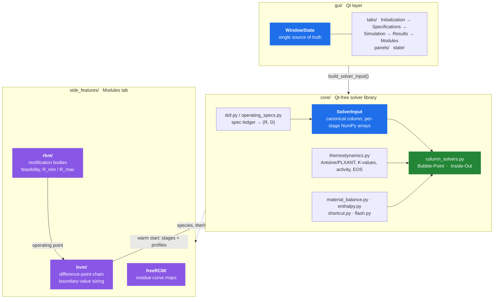
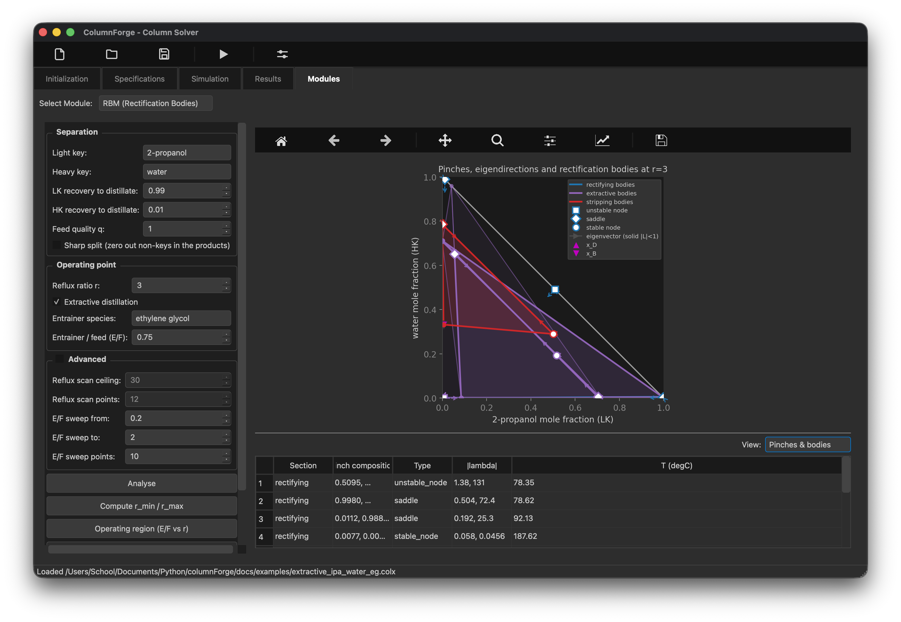

# ColumnForge

ColumnForge is a PySide6 desktop application containing an open-source
toolkit for distillation column synthesis and rigorous equilibrium-stage
simulation. Unlike most commercial simulators, it includes initialization
and synthesis tools such as Boundary Value Methods (BVM), Rectification Bodies
(RBM), Residue Curve Mapping (RCM), and other features for designing difficult
columns and sending to a rigorous simulation in one integrated workflow.


## Why this exists

Commercial simulators ship powerful column solvers, but their design workflows
and initialization methods are proprietary and hard to inspect or extend.
ColumnForge is the open version of that workflow, with the synthesis tools
(RCM, BVM, RBM, FUG, Txy/Pxy) feeding the rigorous solver directly.

|                           | Commercial Simulator          | ColumnForge                                          |
| ------------------------- | ----------------------------- | ---------------------------------------------------- |
| solver internals          | opaque                        | readable Python, one self-check per module           |
| initialization            | proprietary                   | BVM/FUG warm start, every intermediate visible       |
| preliminary design        | separate tools, manual bridge | RCM/BVM/RBM/FUG in-app, sharing the session's thermo |
| when it fails to converge | "no solution found"           | named section, pinch, or spec that caused it         |

## Quick Start

```bash
pip install -r requirements.txt        # PySide6, numpy, scipy, matplotlib
python launch.py                       # run the GUI (canonical entry point)
```

`launch.py` puts `src/python` (for `core`/`gui`) and `src` (for
`side_features.*`) on the path and calls `gui.main_window.main()`. To run a
module directly, replicate those paths:
`PYTHONPATH=src:src/python python -m gui.main_window`.

> [!NOTE]
> **Solver backend.** Python is the backend that ships today, and it needs no
> compiler. A compiled C/Fortran backend selectable from the UI is in progress;
> the sources live in `src/native/`.

### The RCM module needs a compiled library

> [!IMPORTANT]
> **The RCM (residue-curve map) module needs a compiled library** (it calls a Fortran/C solver through `ctypes`).
> Prebuilt libraries ship in `src/side_features/freeRCM/lib/`, but they were built on a machine that may or may
> not share the same architecture as yours. The module will not load and show "Compile RCM_solv.c to use this
> module." instead of a plot. I highly recommend compiling it yourself:
>
> ```bash
> cd src/side_features/freeRCM/build && make    # needs gfortran + a C compiler
> ```
>
> Additional requirements for this include GSL and MINPACK. The rest of the app is unaffected either way.

## Architecture

The GUI stores parameters and hands it to separate solver/module layers for calculation.



> [!TIP]
> `core` never imports `gui`; it is a standalone library you can drive from a
> script or notebook with no Qt installed. Every `core` module carries a runnable
> self-check (`python -m core.column_solvers` and friends), so each file vouches
> for itself independently of the pytest suite.

## The solvers

|                    | method                                       | answers                                                                                    | scope                                               |
| ------------------ | -------------------------------------------- | ------------------------------------------------------------------------------------------ | --------------------------------------------------- |
| **Bubble-Point**   | Wang-Henke MESH                              | rigorous tray-by-tray profile                                                              | CMO, total condenser                                |
| **Inside-Out**     | Boston-Sullivan two-tier                     | same, faster on stiff systems                                                              | CMO or full energy balance                          |
| **BVM**            | difference-point-chain boundary-value method | Stages/section, $$R_(min)$$, $$E/F$$, optimal feed locations                               | sizing/feasibility, energy balance, reactive stages |
| **RBM**            | rectification bodies (Bausa/Marquardt)       | feasibility, R<sub>min</sub> **and** R<sub>max</sub>, (E/F)<sub>min</sub> — no stage count | screening/feasibility, simple + extractive columns  |
| **Shortcut (FUG)** | Fenske-Underwood-Gilliland-Kirkbride         | back-of-envelope N, R<sub>min</sub>, feed stage                                            | screening tool, constant α                          |

### Bubble-Point (Wang-Henke MESH)

**M**aterial balance, **E**quilibrium, **S**ummation, **H**eat balance, solved
stage-by-stage until temperatures stop moving. The per-component material
balance is a tridiagonal system in liquid composition, solved with the Thomas
algorithm: one linear solve per component, per outer iteration.

$$
\underbrace{-L_{n-1} x_{i,n-1}}_{\text{liquid from stage above}} + \underbrace{\big(L_n + V_n K_{i,n}\big) x_{i,n}}_{\text{leaving stage } n} + \underbrace{\big(-V_{n+1} K_{i,n+1} x_{i,n+1}\big)}_{\text{vapor from stage below}} = F_n z_{i,n}
$$

$$
\text{Equilibrium:} \quad y_{i,n} = K_{i,n} x_{i,n}
\qquad
\text{Summation:} \quad \sum_i K_{i,n} x_{i,n} = 1 \quad \Rightarrow \quad T_n \text{ (bubble point)}
$$

with $K_i = \gamma_i \phi_i^{\mathrm{sat}} P_i^{\mathrm{sat}}(T) / (\phi_i^{V} P)$
(see [Thermodynamics](docs/thermodynamics.md)).

Outer loop:

1. assemble the tridiagonal system at the current `T` profile
2. Thomas-solve for `x`
3. bubble-point each stage for a new `T`
4. repeat until `max|ΔT| < tol`

> [!NOTE]
> Constant molar overflow (CMO) by default. An optional `flows_hook` seam lets an
> energy balance replace the CMO flow assumption without touching the assembly
> code.

### Inside-Out

Boston and Sullivan method with an **outer** loop that refreshes
rigorous K-values and freezes them into per-stage relative volatilities, and a
cheap **inner** loop that iterates only those frozen ratios against the material
balance.

**Outer** (expensive thermo, once per pass), freeze a per-stage base K and
relative volatilities:

$$
K_{i,n} = \frac{\gamma_{i,n} \phi_i^{\mathrm{sat}} P^{\mathrm{sat}}_i(T_n)}{\phi^{V}_{i,n} P},
\qquad
K^{b}_{n} = \Big( \textstyle\prod_i K_{i,n} \Big)^{1/n_c},
\qquad
\alpha_{i,n} = \frac{K_{i,n}}{K^{b}_{n}}
$$

**Inner** (no thermo calls), hold $\alpha$ fixed and converge the base K against
the material balance and bubble constraint:

$$
x = \text{tridiagonal solve at } K_{i,n} = \alpha_{i,n} K^{b}_{n},
\qquad
K^{b}_{n,\text{new}} = \Big( \textstyle\sum_i \alpha_{i,n} x_{i,n} \Big)^{-1},
\qquad
\text{until } \frac{|K^{b}_{n,\text{new}} - K^{b}_{n}|}{K^{b}_{n}} < \text{tol}
$$

Refresh $T$ from a rigorous bubble-point on the new $x$, repeat the outer pass
until $\max|\Delta T| < \text{tol}$. Because the inner loop reuses one frozen
$\alpha$, most of the iteration avoids the thermo evaluation that dominates cost
on multicomponent, non-ideal mixtures.

### Boundary Value Method (BVM)

Answers whether a split is reachable and how many stages each section needs.
Given an operating point `(R, S, E/F)`, BVM builds one **difference point**
$\Delta_k$ per column section — the section's net-flow composition, collinear
with every $(x,y)$ pair the section passes through:

$$
\Delta_k = \frac{V_k y_k - L_k x_k}{V_k - L_k}
$$

Each section marches stage by stage: an equilibrium step, then an operating-line
step anchored on $\Delta_k$ (the difference-point definition rearranged, which is
what keeps $\Delta_k$, $x_{k,n+1}$ and $y_{k,n}$ collinear):

$$
\underbrace{y_{k,n} = K(x_{k,n}, T, P) \cdot x_{k,n}}_{\text{equilibrium step}}
\qquad \longrightarrow \qquad
\underbrace{x_{k,n+1} = \frac{V_k y_{k,n} - (V_k - L_k) \Delta_k}{L_k}}_{\text{operating-line step}}
$$

Profiles march inward from each product end until adjacent profiles meet. Two
profiles are **connected** when they come within tolerance in full
$\mathbb{R}^{C-1}$ composition space rather than as a 2-D curve crossing, so the
method is not restricted to the ternaries of textbook BVM. The stage count at
which the connection happens is an output, not an input. Feasibility,
R<sub>min</sub>, feed/draw placement and reactive stages (Ung–Doherty transform)
all build on the same chain.

After Levy, Van Dongen & Doherty (1985) and Doherty & Malone, _Conceptual Design
of Distillation Systems_ (2001); reactive columns follow Ung & Doherty (1995).

> [!TIP]
> A sized BVM column goes straight to Bubble-Point as a **warm start**
> (`api.to_solver`). Module-by-module writeup:
> [`src/side_features/bvm/README.md`](src/side_features/bvm/README.md).

### Rectification Body Method (RBM)

BVM marches profiles and asks whether the curves meet. RBM never marches. A
**pinch** is a stage where nothing changes any more: the equilibrium map and the
section's operating line $y = ax + b$ (with $a = L/V$ and
$b = (\Delta/V)\,\delta$, the same difference point BVM uses) return the
composition to itself.

$$
K(x_p, T, P) x_p = a x_p + b
\qquad\Longleftrightarrow\qquad
x_{p,i}\big(K_i - a\big) = b_i \quad \forall i
$$

Solving that algebraic system on every branch gives a section's pinch points;
spanning them gives a **rectification body**, a linearised stand-in for the set
its profiles can reach. Feasibility is then geometry: adjacent sections' bodies
intersect (gap zero) exactly when one continuous profile can run the whole
column.

That buys three things marching does not:

- The pinch equations are algebraic, so a component with a very small K costs
  nothing. Marching amplifies it by ~1/K per stage.
- Bodies are up to (C−1)-dimensional and intersect generically at any C; two 1-D
  marched profiles generically miss for C ≥ 4.
- An extractive column has a **maximum** reflux as well as a minimum — too much
  reflux washes the entrainer out of the extractive section. The same test gives
  both bounds, and sweeping them against entrainer flow gives the feasible
  operating region, whose nose is (E/F)<sub>min</sub>.

> [!IMPORTANT]
> **RBM gives no stage count** — a body approximates the reachable set, not the
> profile. Use RBM to locate a feasible operating point, BVM to size the column
> there. It also wants **sharp** product specs: exact zeros in $x_D/x_B$ put
> pinches on the simplex edges, where they can be bracketed. A smeared spec (98/2
> recoveries) displaces every pinch off its edge; those are recovered by
> continuation onto the parent face, and any that had to be clipped are counted
> in the panel.

After Bausa, von Watzdorf & Marquardt, _AIChE J._ **44**(10) 2181 (1998),
extended to extractive columns by Brüggemann & Marquardt (2002).

### Shortcut (FUG)

Good starting point for columns with more ideal behavior and CMO validity.

**Fenske**, minimum stages at total reflux:

$$
N_{\min} = \frac{\ln \big[ (x_{LK}/x_{HK})_D (x_{HK}/x_{LK})_B \big]}{\ln \alpha_{LK,HK}}
$$

**Underwood**, minimum reflux (root $\theta$ between the key volatilities):

$$
\sum_i \frac{\alpha_i z_i}{\alpha_i - \theta} = 1 - q
\qquad\Longrightarrow\qquad
R_{\min} + 1 = \sum_i \frac{\alpha_i x_{D,i}}{\alpha_i - \theta}
$$

**Gilliland/Molokanov**, actual stages at operating reflux $R$:

$$
X = \frac{R - R_{\min}}{R + 1},
\qquad
Y = 1 - \exp \left[ \frac{1 + 54.4X}{11 + 117.2X} \cdot \frac{X - 1}{\sqrt{X}} \right],
\qquad
N = \frac{Y + N_{\min}}{1 - Y}
$$

**Kirkbride**, feed-stage location ($N_r$ rectifying, $N_s$ stripping stages):

$$
\frac{N_r}{N_s} = \left[ \frac{B}{D} \cdot \frac{x_{F,HK}}{x_{F,LK}} \cdot \left( \frac{x_{B,LK}}{x_{D,HK}} \right)^{2} \right]^{0.206}
$$

## Thermodynamics

Every solver uses some form of modified Raoult's law, formulated
with the equilibrium ratio $K_i = y_i/x_i$:

$$
K_i = \frac{\gamma_i(x,T) \phi_i^{\mathrm{sat}} P^{\mathrm{sat}}_i(T)}{\phi_i^{V}(y,T,P) P}
$$

| layer                 | models                                                                                                                                                                                                     |
| --------------------- | ---------------------------------------------------------------------------------------------------------------------------------------------------------------------------------------------------------- |
| **vapor pressure**    | Antoine $\log_{10} P^{\mathrm{sat}} = A - B/(T+C)$, or Aspen extended Antoine / PLXANT $\ln P^{\mathrm{sat}} = C_1 + C_2/(C_3+T) + C_4 T + C_5\ln T + C_6 T^{C_7}$, dispatched on coefficient-matrix width |
| **activity** $\gamma$ | NRTL, Wilson, UNIQUAC, two-suffix Margules, UNIFAC group contribution (no binary parameters needed, built from the bundled group-interaction database)                                                     |
| **equation of state** | SRK vapor-phase fugacity, for pressure effects on relative volatility (validated on a 4-atm depropanizer)                                                                                                  |
| **enthalpy**          | constant liquid $c_p$ + Watson-corrected latent heat, $h_V(T) = h_L(T) + \Delta H_{\mathrm{vap},T_b} \left[ (T_c-T)/(T_c-T_b) \right]^{0.38}$                                                              |

Full equations for every model: [`docs/thermodynamics.md`](docs/thermodynamics.md).

I used AI to scrape some parameters for components and test them, and came up with:

- **78 curated components** (`core/data/components.json`), searchable by name,
  alias, CAS, or formula, one click to load into a column. Every record is gated
  by a physical-consistency test: Antoine reproduces Tb within 1 K, ΔHvap
  matches Clausius-Clapeyron within 12%.
- **7 NRTL binary pairs** ship with it, gated against known azeotropes
  (ethanol/water, 2-propanol/water, acetone/chloroform, acetone/methanol).
- **UNIFAC groups for 54 of the 78 components**, loaded with the component, so
  UNIFAC needs no binary parameters and no typing — the way around a missing NRTL
  pair. Each assignment is gated on adding up to the molecular formula, and the
  ester/alcohol groups on reproducing two literature azeotropes (methyl
  acetate/methanol 0.657 at 53.8 °C, ethyl acetate/ethanol 0.539 at 71.8 °C). The
  other 24 are left blank on purpose: the curated group table cannot express them
  (CH₄, ethers, CHCl₃, formic acid, pyridine, …) and UNIFAC then refuses that
  species rather than running ideal.
- The enthalpy seam is shared by the Inside-Out energy balance, enthalpy-based
  feed quality, and condenser subcooling.

> [!WARNING]
> **No silent fallback.** A model with missing parameters raises a user-facing
> error instead of quietly reverting to ideal.


## Modules tab

Standalone tools that share the session's species and thermo but need no full
column defined.

| module              | what it does                                                                                                      |
| ------------------- | ----------------------------------------------------------------------------------------------------------------- |
| **RCM**             | residue-curve maps (the preserved predecessor app, `side_features/freeRCM/`)                                      |
| **BVM**             | size at one `R`, sweep a design map, send a warm start to the rigorous solver, or size a **reactive** column      |
| **RBM**             | pinches + rectification bodies at one point, `r_min`/`r_max`, or the whole feasible **(E/F, r)** operating region |
| **Shortcut (FUG)**  | Fenske/Underwood/Gilliland/Kirkbride report + stages-vs-reflux curve                                              |
| **Txy/Pxy**         | binary bubble/dew loci at fixed P or T, plus an azeotrope table (singular-point classification)                   |
| **Pure Components** | browse/search the 78-species database, plot Psat(T), load straight into the column                                |
| **Phase EQ**        | isothermal / vapor-fraction flash on the loaded species, a live test bench for whichever thermo model is selected |

<table>
  <tr>
    <td width="50%" valign="top">
      <a href="docs/img/modules-bvm.png"></a>
      <br><b>BVM</b> Analysis on a ternary extractive column
    </td>
    <td width="50%" valign="top">
      <a href="docs/img/bvm-profile-prediction.png"></a>
      <br><b>BVM</b> Auto-joined column profile
    </td>
  </tr>
  <tr>
    <td width="50%" valign="top">
      <a href="docs/img/rcm-module.png"></a>
      <br><b>Residue Curve Mapping</b>
    </td>
    <td width="50%" valign="top">
      <a href="docs/img/modules-rbm.png"></a>
      <br><b>Rectifying Body Method</b> for an extractive column with node/eigenvector visualization
    </td>
  </tr>
  <tr>
    <td width="50%" valign="top">
      <a href="docs/img/modules-fug.png"></a>
      <br><b>Shortcut (FUG)</b> stages vs reflux
    </td>
    <td width="50%" valign="top">
      <a href="docs/img/modules-txy.png"></a>
      <br><b>Txy/Pxy</b> binary envelope + azeotropes
    </td>
  </tr>
</table>

### Reactive distillation (BVM module)

Tick **Reaction** in the BVM module, type the stoichiometry (products +, reactants
−), pick the reference component and give `Keq = exp(A + B/T[K])`, and the sizing
runs in Ung–Doherty **transformed compositions**: same difference-point geometry,
one fewer component, chemical equilibrium solved inside every stage. The results
table shows the transformed profile alongside the **physical compositions and the
reaction extent per stage**.

Limits, enforced rather than assumed:

- One equilibrium reaction, **ideal stages**, every stage catalytic (condenser and
  reboiler included, so products sit on the reaction-equilibrium surface).
  Efficiency, entrainer and _Send to Rigorous Solver_ grey out with the reason —
  the MESH solvers carry no reaction terms, so a reactive warm start would
  converge a different column.
- The transform must stay inside the composition simplex, which holds for a
  **one-product** reaction with the product as reference (etherification,
  hydration, hydrogenation). A two-product reaction — any esterification, ester
  plus water — has no such reference, and the sizing says so
  (`leaves_simplex`) instead of quietly returning a wrong column.
- Dropping the reference has to leave **at least three** components, so one
  reaction needs a four-component system (MTBE synthesis has its inert n-butane).
  A two-component transformed problem puts every profile on one line, where
  closest-approach connection is degenerate; that case is refused, not guessed.

Details and the upgrade path:
[`src/side_features/bvm/README.md`](src/side_features/bvm/README.md).

## Column setup and results


- **Species & thermodynamics**: VLE/activity/EOS model choice, editable binary
  interaction tables, searchable or hand-entered component properties.
- **Live degrees-of-freedom status** (`core/dof.py`): how many more specs the
  column needs, and which kinds are valid under the active flow model, before
  you hit run.
- **Interactive column sandbox** (Specifications → Column Overview): stages,
  feeds, draws, interreboiler/intercooler modules on one canvas.
- **Complex topology**: interreboilers and intercoolers carry a signed duty the
  energy balance consumes as a real per-stage term.
- **Threaded solves**: every solver runs on a QThread with live
  iteration/residual progress and a real Abort.
- **Results**: composition, temperature, pressure, flow, K-value, and enthalpy
  profile plots; a McCabe-Thiele diagram for binary columns; a component-aware
  data table; product-stream summary with mass-balance closure; CSV export.
  Display units (°C/K/°F, kmol/h, kg/h, kW/MW/kJ/h) are independent of
  solver-internal units.
- **Save/Load**: the full session persists to `.colx`, versioned JSON.


## Project Structure

```
columnForge/
├── src/
│   ├── python/
│   │   ├── core/          # thermodynamics, solvers, dof, material/energy balance
│   │   │   └── data/      # components.json, unifac_groups.json
│   │   ├── gui/
│   │   │   ├── tabs/      # Initialization / Specifications / Simulation / Results / Modules
│   │   │   ├── panels/    # reusable config panels (species, streams, condenser, ...)
│   │   │   ├── modules/   # BVM, RBM, FUG, Txy/Pxy, Pure Components, Phase EQ widgets
│   │   │   ├── state/     # WindowState (single source of truth) + .colx persistence
│   │   │   └── theme/     # Qt stylesheet
│   │   └── tests/         # headless pytest suite (+ tests/validation/)
│   ├── side_features/
│   │   ├── bvm/           # difference-point-chain BVM solver (own README + tests/)
│   │   ├── rbm/           # rectification-body feasibility / R_min (own tests/)
│   │   └── freeRCM/       # preserved predecessor (residue curve maps)
│   └── native/            # Fortran sources (nifco2.f90), not bound to the app yet
├── docs/                  # thermodynamics.md (equation reference), img/
└── launch.py              # GUI entry point
```

## Testing

The solver and state layers are Qt-free and self-checking. 239 tests, headless:

```bash
QT_QPA_PLATFORM=offscreen python -m pytest src/python/tests/ src/side_features/bvm/tests/ src/side_features/rbm/tests/
```

`src/python/tests/validation/` is the acceptance gate for solver changes: BTX
ideal, a depropanizer through the PLXANT path, ethanol/water against its known
NRTL azeotrope, methanol/water against Perry's VLE data. RBM's own tests cross-check
its R<sub>min</sub> against Underwood on a near-ideal split and its pinch
structure against the published extractive case. Every `core` module is
also runnable standalone as a self-check
(`PYTHONPATH=src/python python -m core.column_solvers`).

> [!NOTE]
> Much of the suite is AI-generated and hasn't had a line-by-line review pass
> yet; it is committed because a green gate you can run beats a private one you
> can't. CI (`.github/workflows/ci.yml`) runs it on 3.11 and 3.12 with pyflakes.

## Conventions worth knowing

> [!IMPORTANT]
>
> - **Stage 0 = distillate (top)** everywhere in the GUI and result profiles.
>   Solvers may use a different internal ordering, converted at the boundary.
> - **Nothing is silently ignored.** Every value you can enter is either consumed
>   by the active solver or visibly greyed out with a "not consumed yet" tooltip.
> - **`.colx` is versioned JSON**, never pickle, so an old save stays readable by
>   a newer build and vice versa.

## Roadmap

- **Selectable compiled backend.** Very fast solves, can run on a potato,
  SciPy and for loops can definitely be a bottleneck in Python.
- **Full energy balance** in the core solvers is opt-in for Inside-Out.
  Bubble-Point is CMO-only (BVM already has its own energy balance).
- **Full N-section BVM.** Extractive works well column profiles match
  MESH solutions well. Great for starting parameters as is, would be cool
  to extend the idea to optimal stage count and feed location(s).
- **RBM → BVM handoff in one click.** RBM finds the feasible operating point and
  BVM sizes the column there, but `r` and `E/F` are copied across by hand today.
  A dedicated RBM README is still to be written.

## License

MIT, see [LICENSE](LICENSE).
